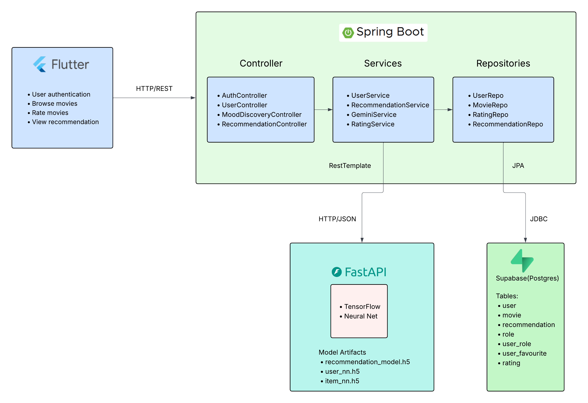
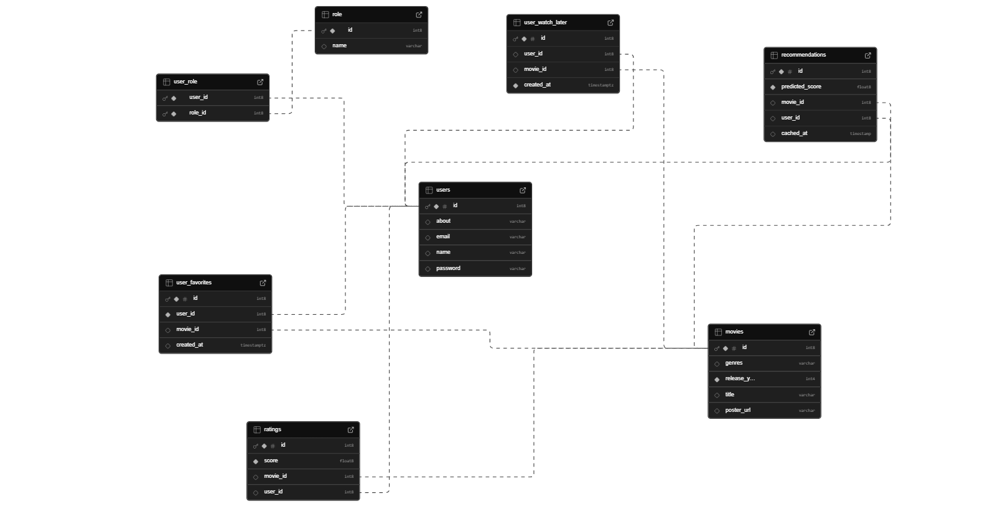
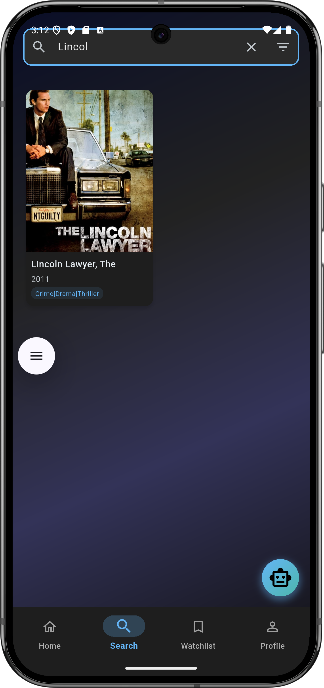
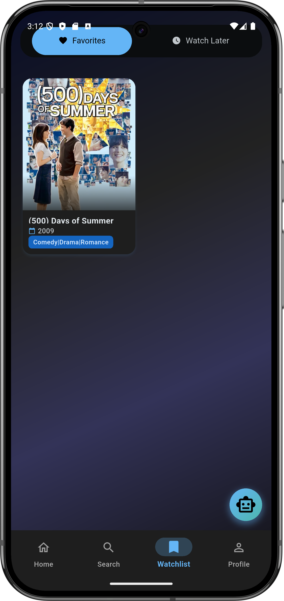

# 🎬 CineMatch

<div align="center">

**A comprehensive movie recommendation platform with intelligent AI-powered suggestions**

[](https://flutter.dev)
[](https://spring.io/projects/spring-boot)
[](https://fastapi.tiangolo.com)
[](https://www.postgresql.org)
[](https://supabase.com)

</div>

---

## 📖 Overview

CineMatch is a full-stack movie recommendation platform that combines modern mobile development with powerful backend services to deliver personalized movie suggestions. The app features AI-powered mood-based recommendations powered by Google Gemini, intelligent chatbot integration, and a seamless user experience across devices.

## ✨ Key Features

### 🔐 User Management
- Secure authentication and authorization using JWT
- Personalized user profiles
- Custom watchlist management

### 🎥 Movie Discovery
- Browse extensive movie database powered by MovieLens Dataset
- Detailed movie information
- Search and filtering
- User rating system

### 🤖 AI-Powered Recommendations
- **Mood Discovery**: Get movie suggestions based on your current mood using Google Gemini AI
- **Neural Network Engine**: FastAPI-powered recommendation algorithm
- **Chat Integration**: AI chatbot for movie-related queries and personalized suggestions

### 🎨 User Experience
- Personalized Recommendation based on genre preferences
- Smooth carousel displays
- Responsive UI design

## 🛠️ Technology Stack

### Frontend
<table>
<tr>
<td><b>Framework</b></td>
<td>Flutter (Dart)</td>
</tr>
<tr>
<td><b>State Management</b></td>
<td>Riverpod</td>
</tr>
<tr>
<td><b>Navigation</b></td>
<td>go_router</td>
</tr>
<tr>
<td><b>API Communication</b></td>
<td>http</td>
</tr>
<tr>
<td><b>Local Storage</b></td>
<td>shared_preferences</td>
</tr>
</table>


### Backend
<table>
<tr>
<td><b>Main Framework</b></td>
<td>Spring Boot (Java 21)</td>
</tr>
<tr>
<td><b>ML Service</b></td>
<td>FastAPI (Python)</td>
</tr>
<tr>
<td><b>Database</b></td>
<td>PostgreSQL via Supabase<br>H2 Database (Testing)</td>
</tr>
<tr>
<td><b>Security</b></td>
<td>Spring Security + JWT</td>
</tr>
<tr>
<td><b>External APIs</b></td>
<td>TMDB API, Google Gemini AI</td>
</tr>
</table>

## 🏗️ Architecture

CineMatch follows a clean, scalable microservices architecture with clear separation of concerns:

### System Architecture


The system consists of three main components:
- **Flutter Frontend**: Mobile application with Riverpod state management
- **Spring Boot Backend**: Main API server handling business logic and data persistence
- **FastAPI ML Service**: Neural network-powered recommendation engine

### Database Schema


Our PostgreSQL database (hosted on Supabase) manages:
- User profiles and authentication
- Movie metadata
- Watchlists and user interactions
- Ratings

### Neural Network Architecture


The recommendation engine uses a sophisticated neural network to analyze user preferences to provide accurate movie suggestions tailored to each user.

## 🚀 Getting Started

### Prerequisites
- Flutter SDK (latest stable version)
- Java 21 JDK
- Python 3.8+
- PostgreSQL database (Supabase account)
- Android Studio / VS code(for mobile development)
- API Keys: TMDB API key, Google Gemini API key

### Backend Setup (Spring Boot)

```bash
git clone https://github.com/M4700F/CineMatch.git

cd CineMatch/backend/springboot

# Create .env file or set environment variables
# See Environment Configuration section below

./mvnw spring-boot:run
```

### ML Service Setup (FastAPI)

```bash
cd CineMatch/backend/fastapi

pip install -r requirements.txt

# On Windows:
.venv\Scripts\activate
# On macOS/Linux:
source .venv/bin/activate

python main.py
```

The FastAPI service will be available at `http://localhost:8001`

### Frontend Setup

```bash

cd CineMatch/frontend

flutter pub get

# Install any emulator from Android Studio
# Run the application on emulator
flutter run -d emulator-5554

# For web
flutter run -d chrome
```

### Environment Configuration

Create environment variables or `.env` file for the Spring Boot backend:

```properties
# Database Configuration (Supabase PostgreSQL)
DB_URL=your_supabase_postgresql_url
DB_USERNAME=your_database_username
DB_PASSWORD=your_database_password

JWT_SECRET=your_jwt_secret

# TMDB API Configuration
TMDB_API_KEY=your_tmdb_api_key
TMDB_API_URL=https://api.themoviedb.org/3

# Google Gemini AI Configuration
GEMINI_API_KEY=your_gemini_api_key
GEMINI_URL=https://generativelanguage.googleapis.com/v1beta/models/gemini-pro:generateContent

# FastAPI Service URL
FASTAPI_URL=http://localhost:8001
```

**Getting API Keys:**
- **TMDB API**: Register at [themoviedb.org](https://www.themoviedb.org/settings/api)
- **Google Gemini**: Get your API key from [Google AI Studio](https://aistudio.google.com/app/u/1/api-keys)
- **Supabase**: Create a project at [supabase.com](https://supabase.com)

📱 Screenshots
<div align="center">
🏠 Home & Discovery
<p>
  
  
  
</p>
🎭 AI-Powered Features
<p>
  
  
  
</p>
👤 User Features
<p>
  
  
</p>
</div>

## 🎯 Roadmap

- [ ] Social features (follow friends, share recommendations)
- [ ] Integration with streaming platforms
- [ ] Movie release notifications

## 📄 License

This project is licensed under the MIT License - see the [LICENSE](LICENSE) file for details.

## Contributors

**Maroof Ahmed**
- GitHub: [M4700F](https://github.com/M4700F)
- [LinkedIn](https://www.linkedin.com/in/maroof-ahmed-a472b3282/)

**Syed Huzzatullah Mihad**
- GitHub: [mihadcse](https://github.com/mihadcse)
- [LinkedIn](https://www.linkedin.com/in/mihadcse/)

**Faiyaz Abrar**
- GitHub: [fazzyboo](https://github.com/fazzyboo)
- [LinkedIn](https://github.com/fazzyboo)

## Acknowledgments

- Movie data provided by [MovieLens](https://grouplens.org/datasets/movielens/)
- AI services powered by [Google Gemini](https://deepmind.google/technologies/gemini/)
- Database hosting by [Supabase](https://supabase.com)
- Icons and assets from the Flutter community

---

## Notes

The backend was hosted on `railway` but due to limited credit it has been stopped. The MovieLens dataset has to be manually uploaded. All the codes are given in the backend/fastapi directory.


**⭐ Star this repository if you find it helpful!**


